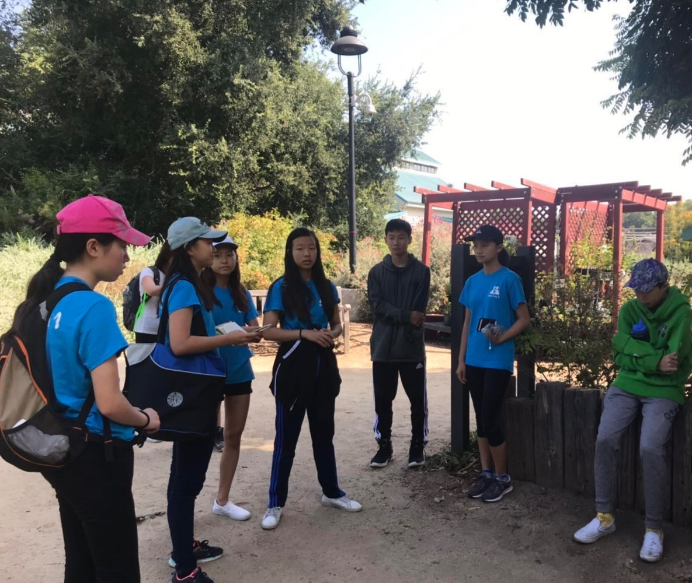

On Saturday, July 13th, Peer1on1 enjoyed a hiking activity at the Fullerton Arboretum. Volunteers and participants were paired up one on one for better communication. The purpose of this activity was to make opportunities to give participants more outdoors time, to get in touch with nature, and to make more friends.

Everyone enjoyed the breathtaking scenery there, from the towering trees to the graceful turtles.

After the tour was over, volunteers danced and played games with the participants, and enjoyed snacks. This activity was a huge success, and everyone had great fun.
